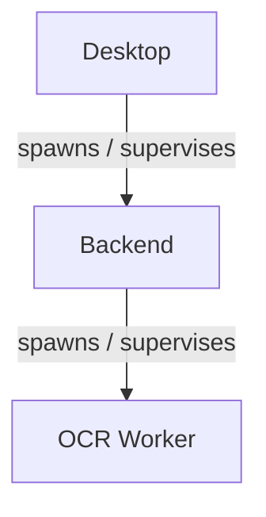

# Z Mining Log - Agent Guide

This file is the operational entry point for automated coding agents working in this repository.

## Read first

Before changing architecture or runtime boundaries, read:

1. `README.md`
2. `docs/architecture.md`
3. the README of the component being changed
4. `docs/current-state.md`

`docs/decisions/` contains historical ADRs. They explain why earlier choices were made, but may use superseded names. Current code and current documentation win when they disagree with an old ADR.

## Repository boundaries

```text
apps/desktop      Electron + React application
apps/backend      Python/FastAPI application
apps/ocr-worker   standalone Windows OCR process

packages/api-contract   generated TypeScript REST contract
packages/ocr-protocol   versioned Python OCR stdio contract
```

Critical invariants:

- Backend must **not** import `zml_ocr_worker` or native OCR dependencies.
- `apps/backend/src/zml_backend/runtime/ocr_worker` owns process lifecycle/transport only.
- OCR implementation and native libraries belong to `apps/ocr-worker`.
- REST wire schemas come from FastAPI/OpenAPI through `packages/api-contract`.
- `apps/desktop/shared` is desktop-internal shared code for Electron main/preload/renderer; it is not a cross-repository package.
- SQLite writes go through `DbWriterWorker`.
- High-frequency position telemetry is not persisted as a raw event stream.
- Input `Signal` objects are transient; durable `Event` objects are persisted/projected.
- Renderer code talks to privileged Electron code through the preload API/IPC, not direct Node access.

The OCR protocol still contains versioned DTO names such as `AgentHello` / `BridgeToAgentMessage`. Do not rename protocol vocabulary casually; treat that as a protocol compatibility change.

## Working rules

- Inspect current code before changing it; do not reconstruct architecture from old docs or branch names.
- Do not revert unrelated user changes.
- Keep changes scoped to the owning component when possible.
- Prefer the repository `just` interface over ad-hoc root npm or Python commands.
- Do not edit generated API contract output by hand; regenerate it.
- Keep code comments in English.
- Avoid introducing a second source of truth for DTOs, paths, configuration, or lifecycle rules.
- During iteration, prefer focused tests/typechecks for the changed component. CI is the complete repository gate.

## Common commands

From the repository root:

```powershell
just dev
just verify
just test
just lint
just build
just package
```

Component commands:

```powershell
just backend --list
just ocr --list
just protocol --list
just api --list
just desktop --list
```

Typical focused verification:

```powershell
just backend verify
just ocr verify
just protocol verify
just api generate
just desktop verify
```

On Windows agent environments, `scripts/agent-env.cmd` can wrap one-shot commands while keeping temp/cache directories inside the repository:

```powershell
.\scripts\agent-env.cmd -- just backend test
.\scripts\agent-env.cmd -- pnpm --filter @zml/desktop typecheck
```

## Generated REST contract

FastAPI/Pydantic is the source of truth:

```text
Backend schemas -> OpenAPI -> packages/api-contract/schema.d.ts -> Desktop
```

Run:

```powershell
just api generate
```

The generated `openapi.json` and `schema.d.ts` are local build artifacts and are intentionally ignored by Git.

## Process ownership



When changing startup/shutdown behavior, preserve the existing ownership chain and packaged process-tree checks. The Windows packaging verification explicitly checks that the OCR child does not survive Backend shutdown.

## Persistence ownership

Do not add direct SQLite writes from API handlers, OCR/chat threads, or Electron. Durable writes belong to the single DB writer path; API routes may open read connections.

## Where to document changes

- Product/repository entry point: `README.md`
- Cross-component architecture: `docs/architecture.md`
- Developer workflow/tooling: `docs/development.md`
- Release/build pipeline: `docs/packaging.md`
- Short-lived project status/priorities: `docs/current-state.md`
- Component-specific behavior: that component's `README.md`
- Durable architecture rationale: a new ADR under `docs/decisions/`

Do not create README files for ordinary source-code folders unless that subsystem becomes independently complex enough to justify its own maintained handbook.
