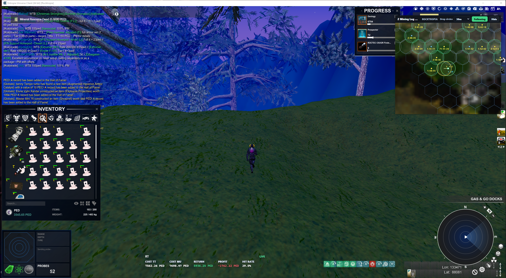
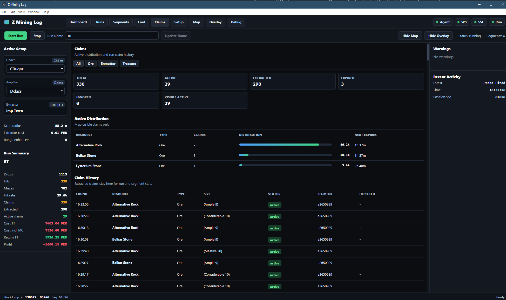
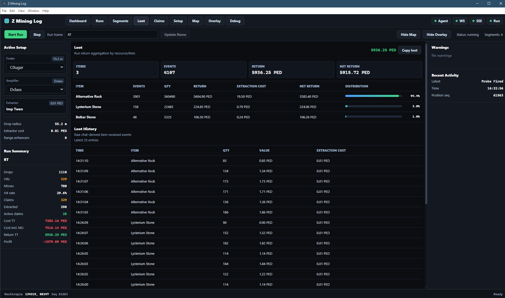
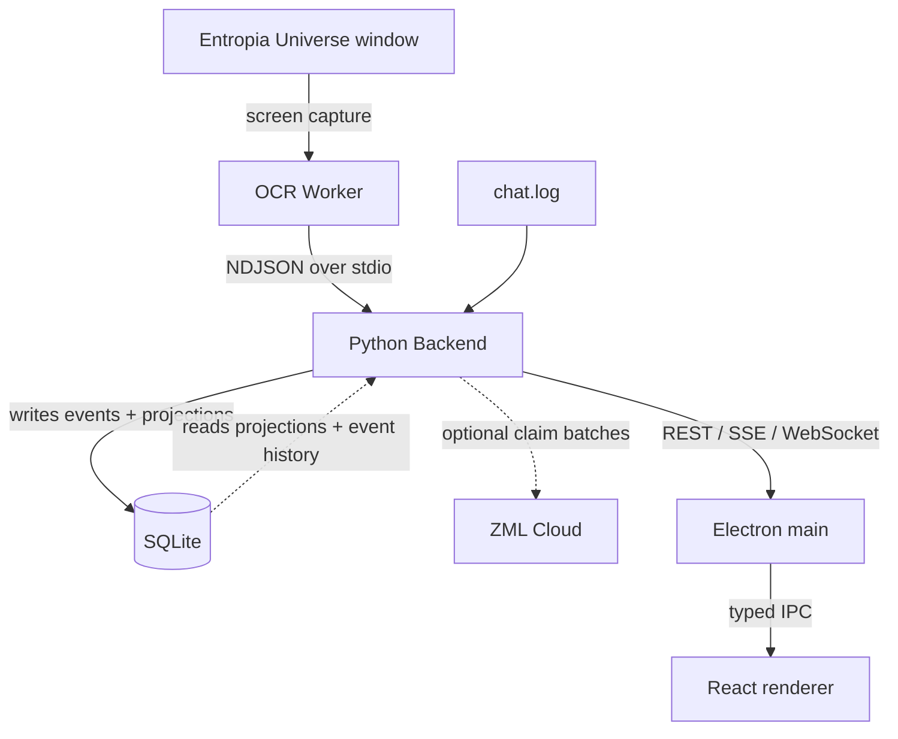
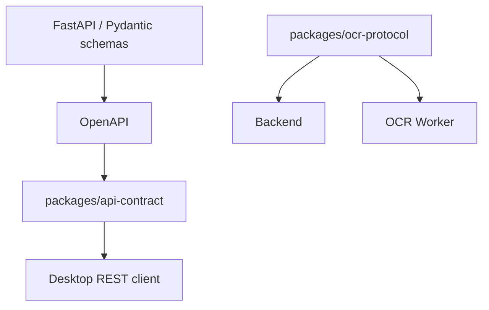

# Z Mining Log

Z Mining Log is a local-first desktop mining assistant for **Entropia Universe**. It combines screen OCR, chat-log parsing, durable local state, and a live map/dashboard so mining runs can be tracked locally first, with optional privacy-minimized claim observations synchronized to ZML Cloud.

The project is intentionally built as a small multi-process desktop system rather than a single OCR script glued to a UI. Its main engineering challenge is turning noisy, timing-sensitive game observations into reliable domain state while keeping native OCR, persistence, realtime transport, and Electron lifecycle concerns isolated from each other.

> **Status:** active work in progress. The core runtime architecture, automated quality gates, and Windows packaging pipeline are in place; live OCR quality and product UX are still being iterated through gameplay testing.



*Live gameplay with the ZML map and run-stat overlays active alongside Entropia Universe.*

## What it does

- Tracks player position from OCR and streams it to the desktop map.
- Reads finder OCR for drops, hit hints, no-resource results, and claim timing data.
- Tails Entropia `chat.log` for claim deeds, loot, enhancer breaks, and depletion messages.
- Persists durable mining facts and read models in local SQLite.
- Optionally synchronizes claim location, resource, size, and observation time to ZML Cloud.
- Tracks runs, setup segments, drops, active claims, loot, and mining tools.
- Provides dashboard, map, overlay, health, and debugging views in Electron/React.
- Supports mock input for development without the game running.

## Engineering highlights

Z Mining Log goes beyond a typical CRUD desktop application in a few deliberate ways:

- **Explicit three-process runtime.** Electron owns the Backend process, and Backend owns the OCR Worker process. Startup, health polling, bounded restart, graceful shutdown, and orphan-process prevention are part of the runtime design.
- **Native OCR isolation.** Windows capture, OpenCV, numpy, `tesserocr`, and tessdata live only in the OCR Worker. Backend cannot import the OCR implementation and communicates with it through a strict, versioned NDJSON stdio protocol.
- **Hardened worker supervision.** The OCR boundary includes capability/version handshake, complete revisioned configuration, acknowledgement before observations are accepted, heartbeat monitoring, monotonic message sequencing, stderr draining, restart/backoff, and terminate/kill escalation.
- **Event-driven persistence with one SQLite writer.** Noisy input `Signal`s are separated from durable domain `Event`s. Events and their read-model projections are committed through `DbWriterWorker` in the same transaction, while API reads use separate read connections.
- **Different transports for different semantics.** REST handles snapshots and commands, SSE carries persisted events, WebSocket carries high-frequency position telemetry, and typed Electron IPC connects main/preload/renderer.
- **Generated HTTP contract.** FastAPI/Pydantic is the source of truth for REST schemas; OpenAPI generates the TypeScript wire contract consumed by Desktop instead of maintaining duplicate DTO definitions manually.
- **Packaging verifies architecture, not just compilation.** Backend and OCR Worker are built as separate PyInstaller artifacts. CI checks that OCR-native dependencies do not leak into Backend, verifies the worker protocol, starts the packaged process tree, checks configuration acknowledgement and shutdown, and repeats the process-tree smoke test after Electron Builder bundles both artifacts.
- **Strict automated verification.** Python components use Ruff, Pyright, and Pytest; Desktop uses strict TypeScript, ESLint, Vitest, and production builds; Windows CI additionally verifies packaged executables.

The result is still a personal desktop application, but the reliability and boundary problems are much closer to a small local distributed system than to a conventional single-process utility.

## Screenshots

### Claims



Active claim distribution, extraction state, expiry tracking, resource breakdown, and run claim history are kept in one operational view.

### Loot



Run-level loot is aggregated from raw chat-derived events into resource totals, extraction cost, net return, and distribution while the underlying event history remains inspectable.

### Live map


The compact map follows the player in real time and combines drop circles, claim timers, player position, and hex-grid coverage without taking over the game screen.

## Architecture



The three local runtime boundaries are intentional:

- **Desktop** owns windows, renderer state, Electron IPC, and the local backend lifecycle.
- **Backend** owns domain logic, persistence, APIs, input coordination, OCR Worker supervision, and optional outbound claim synchronization.
- **OCR Worker** owns screen capture, native OCR dependencies, and recognition pipelines.

Backend never imports the OCR implementation. It depends only on the versioned `zml-ocr-protocol` package and talks to the worker as a child process.

See [docs/architecture.md](docs/architecture.md) for the full design.

## Repository layout

```text
apps/
  desktop/          Electron main, preload, React renderer, desktop-internal shared code
  backend/          FastAPI backend, domain/application logic, SQLite, runtime orchestration
  ocr-worker/       Windows capture and OCR process

packages/
  api-contract/     TypeScript REST wire types generated from FastAPI OpenAPI
  ocr-protocol/     Versioned Python stdio protocol shared by Backend and OCR Worker

docs/
  architecture.md   System boundaries and runtime flows
  development.md    Local development and verification
  packaging.md      Windows artifact and installer pipeline
  current-state.md  Short project handoff and current priorities
  decisions/        Historical architecture decision records
```

## Quick start

Prerequisites:

- Python **3.13** and [`uv`](https://docs.astral.sh/uv/)
- Node.js **22**
- pnpm **10.27** (pinned by the root `package.json`)
- [`just`](https://just.systems/)
- Windows for live OCR and packaged runtime testing

From the repository root:

```powershell
uv python install 3.13
pnpm install --frozen-lockfile
just dev
```

`just dev` synchronizes the Python workspace, regenerates the REST TypeScript contract, and starts the Desktop. Electron owns the local Backend process; Backend owns the OCR Worker process.

Useful repository commands:

```powershell
just verify
just test
just lint
just build
just package
```

Run `just --list` to see the complete root command surface. Component commands are available through modules such as `just backend ...`, `just ocr ...`, `just protocol ...`, `just api ...`, and `just desktop ...`.

## Contracts

Two explicit contracts cross local runtime boundaries:



- REST request/response wire types are generated from FastAPI. Do not manually duplicate them in desktop code.
- OCR stdio messages are strict versioned Pydantic models. Protocol changes should be treated as compatibility changes, not incidental refactors.

## Documentation

- [Architecture](docs/architecture.md)
- [Development](docs/development.md)
- [Packaging](docs/packaging.md)
- [Current state](docs/current-state.md)
- [Backend](apps/backend/README.md)
- [Desktop](apps/desktop/README.md)
- [OCR Worker](apps/ocr-worker/README.md)
- [API contract](packages/api-contract/README.md)
- [OCR protocol](packages/ocr-protocol/README.md)

Historical decisions live under [`docs/decisions/`](docs/decisions/). They are useful context, but current code and the documents above are the source of truth for the present architecture.
