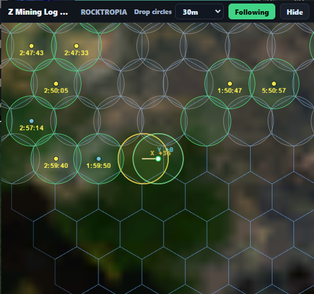

# Z Mining Log

Local-first desktop mining assistant for **Entropia Universe**.

Z Mining Log tracks mining activity by combining OCR, chat log parsing, a Python/FastAPI backend, SQLite persistence, and an Electron/React map UI. The goal is to turn noisy in-game signals into reliable drop, claim, loot, run, and position data without sending gameplay data to an external service.

> Status: active work-in-progress prototype. Core backend/UI flows work and a Windows installer
> pipeline is available; signing, application icon, and public release polish are still pending.

---

## Why This Project Exists

Mining in Entropia Universe produces useful information across several unreliable sources:

- finder UI,
- player position,
- claim deed messages,
- loot messages,
- enhancer break events,
- depletion messages,
- manual decisions made during a mining run.

Tracking all of that manually is error-prone, especially during longer runs. Z Mining Log centralizes the data into a local desktop tool that helps track active claims, drop history, run state, loot, and operational decisions on a live map.

The main challenge is not just rendering a map. The harder part is coordinating several noisy, timing-sensitive inputs and turning them into durable domain facts without corrupting local state.

---

## Current Features

- Live player position tracking from OCR.
- Finder OCR pipeline for:
  - mining drops,
  - hit hints,
  - no-resource results,
  - claim timers,
  - finder modes and units.
- Entropia `chat.log` tailing for:
  - claim deeds,
  - loot messages,
  - enhancer break events,
  - claim depletion messages.
- Local SQLite event journal and read-model projections.
- Electron/React desktop UI with:
  - map,
  - dashboard,
  - overlay,
  - runs,
  - segments,
  - claims,
  - loot,
  - tools,
  - health/debug views.
- Map rendering with:
  - raster tiles,
  - player marker,
  - drop radius circles,
  - active claims,
  - claim timers,
  - hexgrid,
  - follow mode,
  - context actions.
- FastAPI REST endpoints.
- SSE stream for persisted events.
- WebSocket stream for high-frequency position updates.
- Shared TypeScript DTO package for Electron main, renderer, and backend contracts.
- Mock mining input for development without the game running.
- Electron-managed Python backend lifecycle with bounded crash restart and graceful shutdown.
- Windows NSIS packaging with the Python bridge bundled into one installer.

---

## What This Project Demonstrates

This project is meant to show more than a basic CRUD app.

It demonstrates:

- designing a local-first desktop application around unreliable external inputs,
- separating transient input observations from durable domain events,
- coordinating concurrent OCR, chat log, mock, API, and UI command flows,
- keeping SQLite writes safe with a single-writer architecture,
- using an event journal plus read-model projections for reliable state,
- streaming live backend state to a desktop UI through SSE and WebSocket,
- sharing TypeScript contracts across Electron main, renderer, and backend integration code,
- building a practical tool around a real gameplay workflow instead of a toy example.

---

## Tech Stack

### Backend

- Python
- FastAPI
- SQLite
- OCR pipeline
- Chat log parser
- Server-Sent Events
- WebSocket
- Event journal
- Read-model projections
- Single-writer database worker

### Frontend

- Electron
- React
- TypeScript
- deck.gl
- pnpm workspaces
- Shared DTO package

### Tooling

- Ruff
- Pyright
- Pytest
- ESLint
- TypeScript typecheck
- pnpm workspaces

---

## Architecture Overview

Z Mining Log separates noisy observations from durable state.

Input sources emit internal signals. The application layer decides which signals represent meaningful mining facts. Only durable events are persisted and streamed to the UI.

```text
OCR / chat.log / mock inputs
  -> internal signals
  -> runtime input queue
  -> InputCoordinator
  -> MiningCoordinator
  -> durable mining events
  -> DbWriterWorker
  -> SQLite event journal + read-model projections
  -> SSE / WebSocket
  -> Electron/React UI
```

Key architecture decisions:

- **Signals are transient.** They represent observations from OCR, chat logs, mock inputs, or runtime commands.
- **Events are durable.** They represent domain facts and can be persisted, projected, and streamed.
- **SQLite has one writer.** All writes go through `DbWriterWorker`.
- **Read models are projections.** Query-friendly tables are updated in the same transaction as the event journal.
- **Position telemetry bypasses SQLite.** High-frequency position updates are streamed through WebSocket instead of being persisted as raw ticks.
- **The UI reads projections.** The renderer does not rebuild every screen directly from raw events.

---

## Runtime Flows

### Mining Domain Flow

```text
chat.log / finder OCR / mock mining input
  -> input signals
  -> RuntimeInputChannel
  -> InputCoordinator
  -> MiningCoordinator
  -> durable mining events
  -> DbWriterWorker
  -> SQLite
  -> PersistedEventBus
  -> SSE
  -> Electron main
  -> React renderer store
```

### Position Flow

```text
position OCR
  -> PositionTrackingService
  -> latest trusted position
  -> WebSocket
  -> Electron main
  -> React renderer map
```

Raw position ticks are treated as live telemetry, not as a durable event stream. Mining events may attach a fresh position snapshot when needed, but the application does not persist every coordinate update.

---

## Current Mining Model

Current durable mining facts include:

- `MiningDropEvent`  
  A probe/drop was fired with position, mode, cost, and drop radius.

- `MiningHitHintEvent`  
  Finder OCR detected a hit hint with resource, size, range/depth, and expected expiry.

- `MiningNoResourcesEvent`  
  Finder OCR reported no resources for a pending drop.

- `MiningClaimCreatedEvent`  
  A map-facing active claim was created from a hit hint.

- `MiningClaimDepletedEvent`  
  A claim was marked depleted from chat and nearest trusted position.

- `MiningClaimDeedReceivedEvent`  
  Chat reported a claim deed entering inventory.

- `MiningItemReceivedEvent`  
  Chat reported loot entering inventory.

- `MiningEnhancerBrokeEvent`  
  Chat reported enhancer breakage.

Profit tracking is intended to aggregate primarily by run and segment, not by individual claim. Claim lifecycle is mostly used for map state, timers, repair actions, and operational decisions.

---

## Repository Layout

```text
apps/
  game-bridge/      Python backend: inputs, runtime, persistence, REST/SSE/WS API
  electron-ui/      Electron main process and React renderer

packages/
  shared/           Shared TypeScript DTOs and IPC contracts

docs/
  architecture.md   Backend/UI/runtime architecture
  current-state.md  Compact project handoff
  decisions/        Architecture decision records

AGENTS.md           Agent/developer handoff
README.md           Main project overview
```

---

## Development And Packaging

After installing Python and pnpm dependencies, start the desktop app from the repository root:

```bash
pnpm dev
```

Electron starts the backend automatically from `apps/game-bridge/.venv`. If Entropia is not
open yet, the OCR worker remains alive in `degraded` state and checks again automatically.

Development state is isolated from the installed application:

```text
<repo>/.tmp/appdata/backend/   SQLite, mining tools, resources, and OCR profile
<repo>/.tmp/appdata/electron/  renderer storage, preferences, and window state
```

The packaged application continues to keep backend data under
`%LOCALAPPDATA%/z-mining-log`. Set `ZML_APP_DATA_DIR` to explicitly select a different
backend data directory. Individual path overrides such as `ZML_DB_PATH` still take priority.

For a separately managed backend, set `ZML_MANAGE_BACKEND=0` before starting Electron. Setting
an explicit `ZML_BACKEND_URL` also disables local process ownership unless management is
explicitly re-enabled.

Build the complete Windows package with:

```bash
pnpm package
```

This packages the Python bridge, stages it under Electron resources, and creates an NSIS
installer under `apps/electron-ui/release/<version>/`. The GitHub Actions Windows packaging
workflow uploads installers for manual/snapshot builds. A tag matching the desktop version,
for example `v0.1.0`, additionally creates a GitHub Release.

---

## Screenshots

Screenshots are not committed yet.

Recommended screenshots to add:

1. main dashboard,
2. mining map with player position, drop circles, and active claims,
3. claim/run details panel,
4. overlay/debug view.

```text
docs/screenshots/
  dashboard.png
  map.png
  run-details.png
  overlay.png
```

Once available, they should be embedded here:

```md


```

---

## Running Locally

The project uses pnpm workspaces.

```bash
corepack pnpm install
```

Run the desktop UI and backend in development mode:

```bash
corepack pnpm dev
```

Backend verification:

```bash
corepack pnpm bridge:verify
```

Frontend verification:

```bash
corepack pnpm frontend:verify
```

Full verification:

```bash
corepack pnpm verify
```

---

## Backend API Snapshot

Default backend address:

```text
127.0.0.1:17171
```

Useful endpoints:

```text
GET /health
GET /events/latest
GET /events/stream
GET /api/v1/mining/drops?window_minutes=30
GET /api/v1/mining/claims?active=true
GET /api/v1/runs/active
WS  /ws/position
```

---

## Configuration

Useful environment variables:

```text
ZML_LOG_LEVEL
ZML_APP_DATA_DIR
ZML_ERROR_LOG_PATH
ZML_DB_PATH
ZML_CHAT_LOG_PATH
ZML_MINING_RESOURCE_CATALOG_PATH
ZML_CHAT_START_AT_END
ZML_OCR_ENABLED
ZML_MOCK_INPUTS
ZML_MOCK_MINING_INTERVAL_MS
ZML_FINDER_DEBUG
ZML_FINDER_RECORDING
ZML_FINDER_RECORDING_DIR
ZML_OCR_PROFILING
```

By default, normal logs stay on the console and only error-level logs are written to the backend error log.

---

## Project Status

Working:

- OCR/chat/mock input ingestion.
- Mining drop event creation.
- Hit hint and no-resource handling.
- Active claim lifecycle basics.
- Claim depletion from chat messages.
- Local SQLite event persistence.
- Read-model projections.
- REST/SSE/WebSocket backend integration.
- Electron/React map and dashboard integration.
- Shared TypeScript DTO package.
- Mock mining input for local development.

In progress:

- Run and segment profit aggregation.
- Claim deed OCR and precise claim confirmation.
- User-configurable finder/tool profiles.
- Radius, decay, markup, and equipment configuration.
- Better resource coloring/icons.
- Richer claim UI.
- CI and release packaging.
- Cleanup of old OCR experiments and temporary debug assets.

---

## Known Limitations

- This is not a polished public release yet.
- Packaging and release flow are not production-ready.
- OCR stability still depends on UI layout, resolution, and calibration.
- Some old OCR experiments and temporary fixtures still need cleanup.
- Run/segment accounting is still being refined.
- Claim-level profit is intentionally not the main accounting model yet.
- CI is planned but not fully wired.

---

## Roadmap

Near-term priorities:

- Finish run/segment ledger for costs and loot.
- Add claim deed OCR and `ClaimConfirmedEvent`.
- Add user-configurable finder/tool profiles.
- Improve map claim UI and resource styling.
- Add GitHub Actions for backend and frontend checks.
- Clean OCR experiment folders and document remaining fixtures.
- Package the Electron app for easier local installation.

---

## Development Notes

Important project conventions:

- `Signal` means an internal observation from an input source.
- `Event` means a durable domain fact.
- `Command` means a user/API/runtime intent.
- `Projection` means a query table derived from durable events.

SQLite rules:

- Do not write to SQLite directly from input threads.
- Do not write to SQLite directly from API handlers unless explicitly transitional.
- Persist events and projection changes in the same transaction.
- Use separate read connections for API reads.
- Keep high-frequency position telemetry out of the event journal.

---

## License

No license selected yet.
