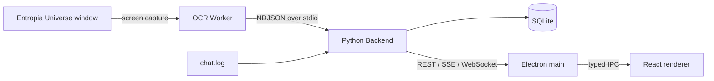
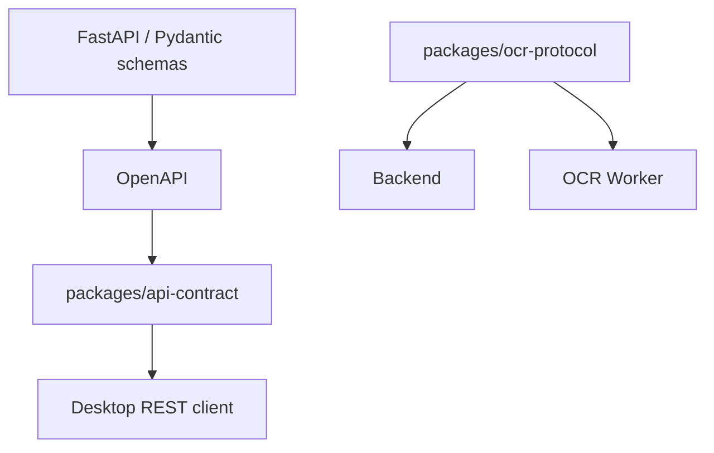

# Z Mining Log

Z Mining Log is a local-first desktop mining assistant for **Entropia Universe**. It combines screen OCR, chat-log parsing, durable local state, and a live map/dashboard so mining runs can be tracked without sending gameplay data to an external service.

> **Status:** active work in progress. The current runtime and packaging path is Windows-first because screen capture and OCR rely on Windows-native dependencies.

## What it does

- Tracks player position from OCR and streams it to the desktop map.
- Reads finder OCR for drops, hit hints, no-resource results, and claim timing data.
- Tails Entropia `chat.log` for claim deeds, loot, enhancer breaks, and depletion messages.
- Persists durable mining facts and read models in local SQLite.
- Tracks runs, setup segments, drops, active claims, loot, and mining tools.
- Provides dashboard, map, overlay, health, and debugging views in Electron/React.
- Supports mock input for development without the game running.

## Architecture



The three runtime boundaries are intentional:

- **Desktop** owns windows, renderer state, Electron IPC, and the local backend lifecycle.
- **Backend** owns domain logic, persistence, APIs, input coordination, and OCR Worker supervision.
- **OCR Worker** owns screen capture, native OCR dependencies, and recognition pipelines.

Backend never imports the OCR implementation. It depends only on the versioned `zml-ocr-protocol` package and talks to the worker as a child process.

See [docs/architecture.md](docs/architecture.md) for the full design.

## Repository layout

```text
apps/
  desktop/          Electron main, preload, React renderer, desktop-internal shared code
  backend/          FastAPI backend, domain/application logic, SQLite, runtime orchestration
  ocr-worker/       Windows capture and OCR process

packages/
  api-contract/     TypeScript REST wire types generated from FastAPI OpenAPI
  ocr-protocol/     Versioned Python stdio protocol shared by Backend and OCR Worker

docs/
  architecture.md   System boundaries and runtime flows
  development.md    Local development and verification
  packaging.md      Windows artifact and installer pipeline
  current-state.md  Short project handoff and current priorities
  decisions/        Historical architecture decision records
```

## Quick start

Prerequisites:

- Python **3.13** and [`uv`](https://docs.astral.sh/uv/)
- Node.js **22**
- Corepack / pnpm **10.27**
- [`just`](https://just.systems/)
- Windows for live OCR and packaged runtime testing

From the repository root:

```powershell
uv python install
corepack enable
pnpm install --frozen-lockfile
just dev
```

`just dev` synchronizes the Python workspace, regenerates the REST TypeScript contract, and starts the Desktop. Electron owns the local Backend process; Backend owns the OCR Worker process.

Useful repository commands:

```powershell
just verify
just test
just lint
just build
just package
```

Run `just --list` to see the complete root command surface. Component commands are available through modules such as `just backend ...`, `just ocr ...`, `just protocol ...`, `just api ...`, and `just desktop ...`.

## Contracts

Two explicit contracts cross runtime boundaries:



- REST request/response wire types are generated from FastAPI. Do not manually duplicate them in desktop code.
- OCR stdio messages are strict versioned Pydantic models. Protocol changes should be treated as compatibility changes, not incidental refactors.

## Documentation

- [Architecture](docs/architecture.md)
- [Development](docs/development.md)
- [Packaging](docs/packaging.md)
- [Current state](docs/current-state.md)
- [Backend](apps/backend/README.md)
- [Desktop](apps/desktop/README.md)
- [OCR Worker](apps/ocr-worker/README.md)
- [API contract](packages/api-contract/README.md)
- [OCR protocol](packages/ocr-protocol/README.md)

Historical decisions live under [`docs/decisions/`](docs/decisions/). They are useful context, but current code and the documents above are the source of truth for the present architecture.
