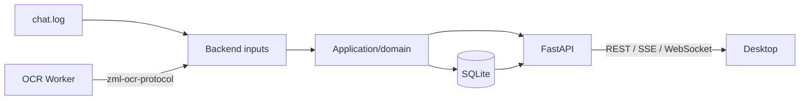
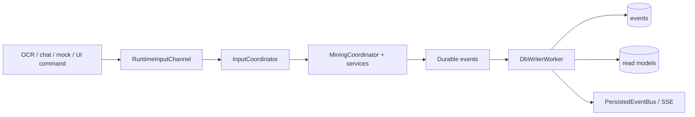

# Z Mining Log Backend

The Backend is the local Python application that turns noisy game inputs into durable mining state and exposes that state to the Desktop.

It owns FastAPI, application/domain logic, runtime orchestration, SQLite persistence, chat-log input, and supervision of the standalone OCR Worker.

## Boundary



The Backend **does not import the OCR Worker package or native OCR stack**. `zml-ocr-worker` is a child-process runtime dependency. The Python dependency shared across the boundary is only `zml-ocr-protocol`.

## Source layout

```text
src/zml_backend/
  api/          FastAPI routes, schemas, dependencies, SSE/WS channels
  application/  use cases, mining coordination, position tracking
  domain/       durable events, value objects, pure domain behavior
  inputs/       chat, OCR protocol, and mock adapters
  persistence/  SQLite schema, readers, journal, projections
  runtime/      queues, workers, lifecycle, supervision, bootstrap
  resources/    packaged seed/reference data
```

See [`../../docs/architecture.md`](../../docs/architecture.md) for cross-component flows.

## Runtime flow



Signals are transient observations. Events are durable facts. Do not persist raw input signals simply to make them observable.

## Commands

From the repository root:

```powershell
just backend --list
just backend config
just backend dev
just backend mock
just backend ocr
just backend finder-debug
just backend test
just backend verify
just backend package
```

`just backend verify` runs Ruff lint, Ruff format check, Pyright, and Pytest.

### Input modes

The developer CLI supports:

- `env` — use current environment configuration;
- `live` — OCR enabled, mock mining disabled;
- `mock` — OCR disabled, mock mining enabled;
- `hybrid` — OCR and mock mining enabled;
- `no-inputs` — both disabled.

The root `just dev` path normally starts Backend through Electron rather than running it manually.

## OCR Worker supervision

Backend starts the worker through `runtime/ocr_worker` and adapts protocol observations under `inputs/ocr_worker`.

The supervisor provides:

- child-process stdin/stdout/stderr transport;
- hello/capability validation;
- complete revisioned `apply_config` handshake;
- sequence-ID validation;
- heartbeat monitoring;
- structured worker health;
- bounded restart/backoff;
- graceful shutdown with terminate/kill escalation.

A missing Entropia window is treated as a recoverable capture condition rather than a reason to crash/restart the process.

The architecture test `tests/test_ocr_process_boundary.py` protects this separation.

## Persistence rules

SQLite has one writer: `DbWriterWorker`.

- Durable events and their projections are written in the same transaction.
- API routes may open separate read connections.
- Input threads and API handlers must not create a second ad-hoc write path.
- Player-position ticks are live telemetry and are not persisted as a raw stream.

Monetary amounts are stored as integer mPEC to avoid floating-point drift:

```text
1 PED = 100 PEC = 100000 mPEC
```

## API surfaces

The Backend exposes three categories of local transport:

- **REST** for queries, snapshots, and commands;
- **SSE** (`/events/stream`) for persisted event notifications;
- **WebSocket** (`/ws/position`) for high-frequency position telemetry.

FastAPI/Pydantic HTTP schemas are the source of truth for `packages/api-contract`. When a REST schema changes, regenerate the TypeScript contract with:

```powershell
just api generate
```

## Key configuration

Most runtime configuration is environment-driven through `zml_backend.settings.Settings`.

Common variables:

```text
ZML_HOST / ZML_PORT
ZML_APP_DATA_DIR
ZML_DB_PATH
ZML_CHAT_LOG_PATH
ZML_OCR_ENABLED
ZML_OCR_WORKER_PATH
ZML_OCR_CAPTURE_HZ
ZML_OCR_PROFILE_PATH
ZML_MOCK_INPUTS
ZML_LOG_LEVEL
```

OCR recording/profiling and path overrides are also available; use `just backend config` and `settings.py` as the authoritative list rather than duplicating every setting here.

## Application data

Default development Backend state:

```text
<repo>/.tmp/appdata/backend
```

Packaged state:

```text
%LOCALAPPDATA%/z-mining-log
```

`ZML_APP_DATA_DIR` overrides the base directory, while explicit path variables such as `ZML_DB_PATH` take precedence for their individual resource.

## Packaging

```powershell
just backend package
```

produces:

```text
apps/backend/dist/zml-backend/zml-backend.exe
```

The artifact intentionally excludes OCR-native dependencies. Full artifact/process-tree verification is documented in [`../../docs/packaging.md`](../../docs/packaging.md).
