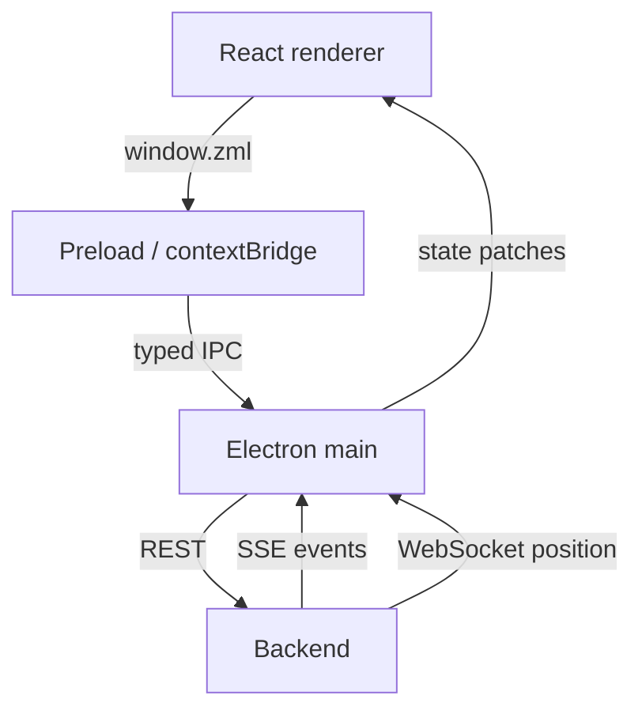
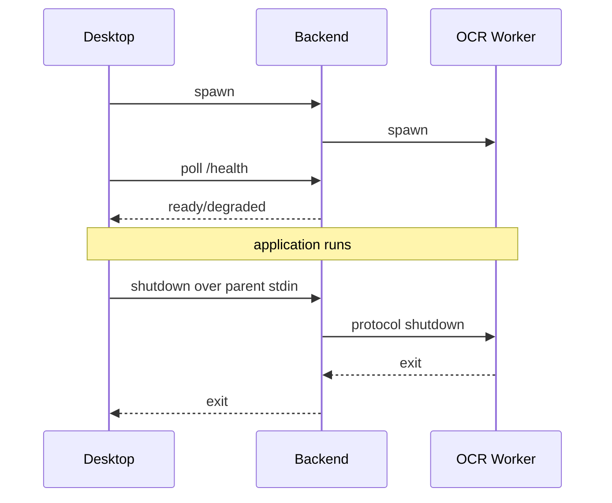

# Z Mining Log Desktop

The Desktop is the Electron + React application. It owns user-facing windows, the renderer security boundary, local Backend process ownership, Backend clients, and distribution of live state to renderer windows.

## Runtime boundary



Renderer windows do not talk directly to Python and do not receive Node integration.

## Source layout

```text
electron/
  backend/      REST/SSE/WS clients and Backend process manager
  ipc/          IPC handlers and state pushes
  mining/       Electron-side mining state application
  runs/         Electron-side run state application
  windows/      BrowserWindow creation/state/loading
  mocks/        Desktop mock implementations
  main.ts       Electron entry point
  preload.ts    narrow renderer API
  runtime.ts    Electron-side runtime snapshot

src/            React renderer UI
shared/         code shared only by Electron main/preload/renderer
```

`shared/` is intentionally **inside** the Desktop application. It is not a generic repository package and should contain only contracts/models/helpers that genuinely cross Desktop internal boundaries.

## Security model

Browser windows use:

```text
contextIsolation = true
nodeIntegration = false
```

The preload exposes a narrow `window.zml` API backed by known IPC commands. Prefer adding a specific command over exposing generic filesystem/process access to renderer code.

## Backend lifecycle

In the default local development and packaged paths, Electron owns Backend lifecycle.



Unexpected Backend exits use bounded restart. An explicitly configured external Backend is not killed by Desktop.

Environment overrides:

```text
ZML_BACKEND_URL
ZML_MANAGE_BACKEND
```

## REST contract

Desktop depends directly on `@zml/api-contract` for HTTP wire schemas generated from FastAPI/Pydantic.

```text
Backend Pydantic -> OpenAPI -> @zml/api-contract -> Desktop adapters
```

Desktop may expose ergonomic camelCase models, but REST wire shapes should be derived from the generated contract rather than copied by hand.

Regenerate with:

```powershell
just api generate
```

## Commands

From the repository root:

```powershell
just desktop --list
just desktop dev
just desktop dev-mocks
just desktop typecheck
just desktop lint
just desktop test
just desktop build
just desktop verify
just desktop package
```

Normal full-application development uses:

```powershell
just dev
```

because the root recipe also syncs Python and regenerates the API contract.

## Mock mode

For UI work without the real Backend/game runtime:

```powershell
just desktop dev-mocks
```

The mock Desktop path exercises renderer/Electron behavior without creating the normal Backend process tree.

## Desktop state

Electron main keeps an in-memory runtime snapshot containing run/mining/tool/stream state. It pushes bootstrap state and incremental patches through IPC to all renderer windows.

The renderer should treat Electron main as the Desktop-side source for live state rather than opening independent REST/SSE/WS connections from every window.

## Windows

The application currently creates:

- main dashboard window;
- map window;
- transparent overlay window.

Window bounds/preferences are persisted separately from Backend state.

Development Electron data:

```text
<repo>/.tmp/appdata/electron
```

## Packaging

The Desktop package receives prebuilt Python artifacts in:

```text
resources/backend/
resources/ocr-worker/
```

Electron Builder bundles them as extra resources and produces the NSIS installer. Use the root `just package` for the complete pipeline rather than packaging Desktop alone unless the Python resources have already been staged deliberately.

See [`../../docs/packaging.md`](../../docs/packaging.md).
