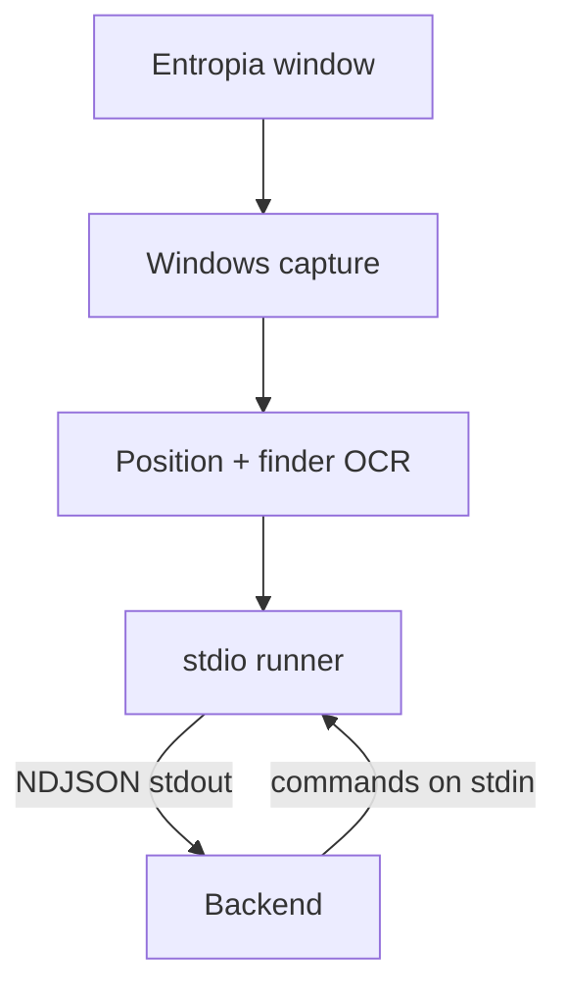
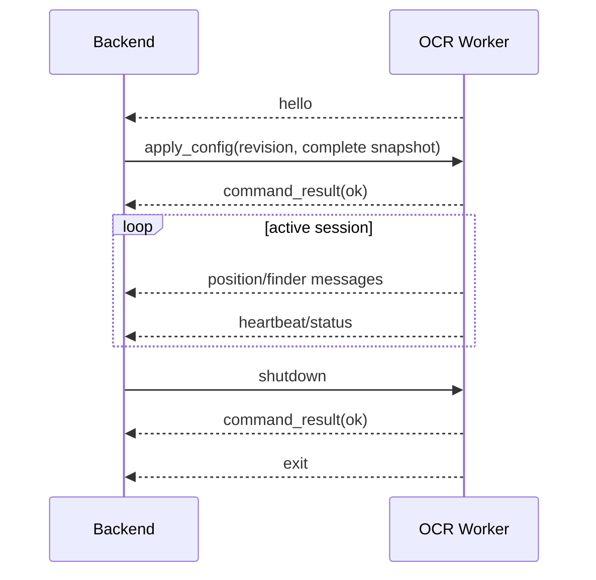

# Z Mining Log OCR Worker

The OCR Worker is a standalone Windows process responsible for screen capture and OCR. It contains the native OCR stack so the Backend can remain a clean Python/FastAPI process without capture/OCR implementation dependencies.

## Boundary



The worker imports `zml-ocr-protocol` but imports no Backend code.

## Native/runtime dependencies

The worker owns dependencies such as:

- `mss`;
- numpy;
- OpenCV headless;
- `pywin32`;
- `tesserocr`;
- packaged Tesseract traineddata.

The runtime is pinned to Python 3.13 because the Windows `tesserocr` dependency is supplied as a CPython 3.13 wheel.

## Source layout

```text
src/zml_ocr_worker/
  calibration/  Compass/Finder location, coordinate layout, and recovery
  capture/      screen/window capture
  pipelines/    finder and position recognition pipelines
  runtime/      protocol runner, lifecycle, profiling, native runtime setup
  config.py     applied OCR configuration / ROI conversion
  cli.py        worker CLI
  doctor.py     environment/native dependency diagnostics
  finder_debug.py
```

This application follows OCR pipeline ownership rather than the Backend's DDD-style layers.

## Protocol lifecycle

`stdio` mode reserves stdout for protocol traffic. Logs belong on stderr.



The worker does not begin publishing normal observations until a complete configuration revision has been accepted.

Reapplying the same revision with identical values is idempotent. Stale revisions or conflicting data for an already-applied revision are rejected.

EOF on stdin is also treated as parent shutdown so the worker cannot remain alive after losing its owner under normal operation.

## Commands

From the repository root:

```powershell
just ocr --list
just ocr doctor
just ocr stdio
just ocr finder-debug --help
just ocr test
just ocr verify
just ocr package
```

Useful direct CLI behavior is also exposed by `zml-ocr-worker --version`, `doctor`, and `stdio` inside the uv workspace.

### UI locator debug command

The calibration tooling can evaluate a recorded **full Entropia client frame**:

```powershell
uv run --package zml-ocr-worker zml-ocr-worker locate-ui .\entropia.png
uv run --package zml-ocr-worker zml-ocr-worker locate-ui .\entropia.png --annotated .\located.png
```

It prints the detected Finder/Compass rectangles, confidence, Compass radar radius/scale, and a coordinate read produced by the normal `PositionPipeline` using scale-aware Lon/Lat layouts.

### Live auto-calibration test

The integration branch can run the same locators in the normal capture loop. It is intentionally opt-in while live validation is in progress:

```powershell
$env:ZML_OCR_AUTO_CALIBRATION = "1"
```

With the flag enabled:

- Finder is located from the full client frame and its locked crop is reused while the panel remains present;
- Compass is located by radar geometry and its detected center/radius derive dynamic Lon/Lat digit strips;
- the existing `PositionPipeline` still owns preprocessing, OCR, parsing, and coordinate sanity checks;
- transient invalid position reads are tolerated;
- after several consecutive invalid reads, nearby Lon/Lat vertical offsets are tried;
- after all line-layout variants fail, the whole Compass is reacquired;
- a successful unchanged position is healthy OCR and does not trigger recalibration;
- full-frame Compass searches are throttled while the panel cannot be found.

The flag defaults to off until the locator has been validated live across enough UI layouts. The legacy fixed ROI path remains unchanged when the flag is disabled.

## Health behavior

Loss/absence of the Entropia window is not a fatal worker error. Capture reports a degraded/waiting state and retries. Fatal pipeline/runtime errors are reported through status/protocol failure and can cause Backend supervision to restart the process.

## Diagnostics

The worker contains finder crop recording, position ROI snapshots, profiling, and finder debug tooling. Backend owns the desired configuration snapshot and sends the relevant settings through the protocol.

Do not move these native/debug implementations back into Backend just to simplify a call path; the process boundary exists partly to isolate native capture/OCR behavior from the API/runtime process.

## Packaging

```powershell
just ocr package
```

produces:

```text
apps/ocr-worker/dist/zml-ocr-worker/zml-ocr-worker.exe
```

with private native libraries and tessdata. Backend packaging intentionally excludes those files.

The complete packaged process boundary is verified by `scripts/verify-python-artifacts.ps1` and the Windows CI/release workflows. See [`../../docs/packaging.md`](../../docs/packaging.md).
