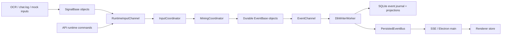
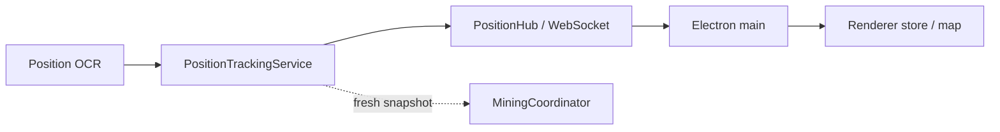
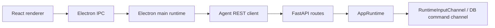
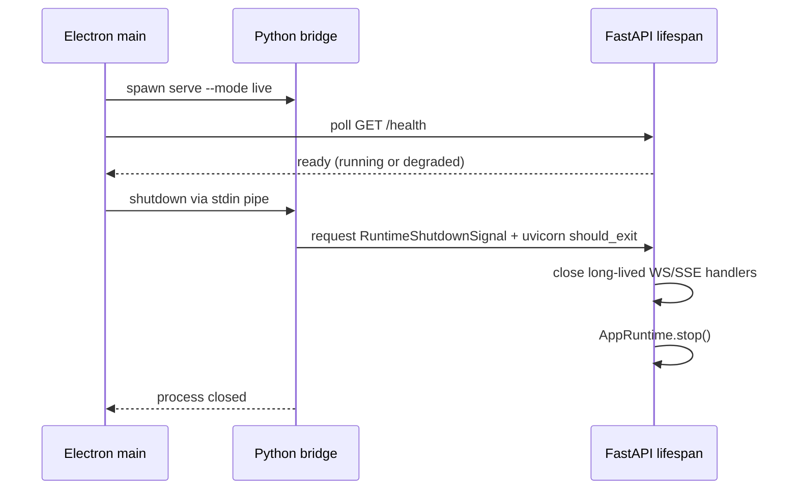

# Architecture

Updated: 2026-08-09

Z Mining Log is a local desktop application. The Python backend observes the
game, derives durable mining facts, persists them to SQLite, and streams live
state to Electron. The Electron app owns the desktop windows and renders the
dashboard, map, overlay, and tool setup UI.

## Repository Layout

```text
apps/
  game-bridge/       Python backend: inputs, runtime, API, persistence
  ocr-agent/         Screen capture, OCR pipelines, diagnostics, stdio runner
  electron-ui/       Electron main process and React renderer

packages/
  ocr-protocol/      Versioned Python DTOs and NDJSON codec
  shared/            Shared TypeScript DTOs, IPC channels, and map helpers

docs/
  decisions/         Architecture decision records
```

## Backend Layers

```text
api/
  FastAPI app, REST routes, SSE, WebSocket, dependency wiring

inputs/
  OCR adapters, chat tailing, mock sources; emits SignalBase subclasses

application/
  use-case/business logic: mining coordinator, correlators, equipment,
  runs/segments, position tracking

domain/
  durable events, value objects, pure domain calculations

runtime/
  queues, workers, coordinator loop, DB writer loop, shutdown/supervision

persistence/
  SQLite schema, event store, readers, projection writers

resources/
  seed/user resource catalog
```

The intended dependency direction is roughly:

```text
api -> runtime/application/persistence readers
inputs -> events/domain models
application -> domain/events/resources/runtime command abstractions
runtime -> application/persistence/events
persistence -> domain/events
domain -> no app/runtime/persistence imports
```

## OCR Implementation Boundary

`apps/ocr-agent` owns Windows capture, ROI models, finder and position
pipelines, recording/profiling tools, `tesserocr`, OpenCV, numpy, and tessdata.
Its runner emits `zml-ocr-protocol` messages and imports no Game Bridge modules.

During the migration, Game Bridge supports two implementations of its
`OcrInputSource` port. `EmbeddedOcrInputSource` runs the agent runner in-process
and remains the default rollback path. `OcrAgentSupervisor` starts the agent's
`stdio` entrypoint as a child process when `ZML_OCR_TRANSPORT=agent`, validates
the initial `hello`, drains stdout/stderr concurrently, monitors heartbeats, and
restarts failed processes with bounded exponential backoff. Both transports use
one mapper for position and finder DTOs, so downstream application behavior is
the same.

In agent mode Game Bridge owns one complete desired configuration snapshot. It
sends revisioned `apply_config` after each `hello` and accepts OCR observations
only after the matching `command_result` acknowledges that revision. A restarted
agent therefore receives the same full snapshot before capture resumes; it does
not reconstruct state from child-process environment or deltas. Reapplying an
identical revision is idempotent, while stale or conflicting revisions fail the
configuration handshake.

The agent reports a missing game window as a recoverable capture state. Health
diagnostics therefore distinguish `failure_kind=capture` with
`process_state=window_unavailable` from process/protocol failures and restart
backoff. Shutdown first sends a protocol command and closes stdin, then escalates
through wait, terminate, and kill if the child does not exit. The agent also
exits cleanly when it observes stdin EOF.

## Signal To Event Flow



Rules:

- Signals are internal and transient.
- Durable events are persisted and may be streamed.
- `InputCoordinator` is the single sequential boundary that turns input signals
  and runtime commands into durable events.
- `DbWriterWorker` is the single SQLite writer.
- Projections are updated inside the same transaction as the event write.

## Position Flow

Position is telemetry, not a durable event stream.



`PositionTrackingService` accepts OCR snapshots, filters outliers, keeps the
latest trusted world position, and publishes position updates to the UI. Mining
events may attach a fresh position snapshot through `PositionProvider`, but raw
position ticks are not stored in SQLite.

## Mining Coordinator

`application.mining.coordinator.MiningCoordinator` is the application boundary
for mining state. It is deliberately not a DB writer. It coordinates smaller
services/correlators and returns durable events to the runtime.

Current sub-services/correlators:

- `FinderDropCorrelator`: finder OCR signals -> drop, hit hint, no-resource.
- `MiningChatCorrelator`: chat signals -> deed received, item received,
  enhancer broke, depleted signal handling.
- `ClaimLifecycleCorrelator`: hit hints/depletion/manual commands -> claim
  created/depleted/ignored.
- `MiningEquipmentCommandHandler`: equipment profile changes.
- `RunCommandHandler`: run commands. Some run commands are still transitional
  DB-backed commands.
- `RunSessionService`: active run and segment context for drops.

Target direction:

- Mining commands enter the runtime queue.
- Coordinator/services decide what durable events are produced.
- DB writer persists events and projections.
- API routes should not directly mutate mining state unless it is an explicitly
  transitional DB-backed command.

## Persistence Model

SQLite stores both:

1. `events`: durable event journal for recovery/debug/rebuild.
2. projection tables: query-friendly read models such as drops, claims,
   loot totals, and run segments.

This is event-sourced in spirit, but pragmatic. The event table is not the only
source the UI reads. The UI primarily reads projection tables through REST and
receives persisted event notifications through SSE.

Projection writes happen inside `EventWriter.write()` using a
`CompositeEventProjector`. If a projector fails, the event write rolls back too.
This keeps event journal and read models consistent while preserving the
single-writer SQLite rule.

## API And UI Flow

Electron main is the bridge between renderer windows and backend APIs:



Live updates:

- backend SSE publishes persisted mining/run events;
- backend WebSocket publishes high-frequency position telemetry;
- Electron main keeps an in-memory runtime snapshot and pushes patches to all
  renderer windows;
- React reads from `zmlRendererStore`.

Shared contracts belong in `packages/shared`. If a backend wire schema changes,
update shared DTOs and Electron main/renderer handling together.

## Windows

Main Electron windows:

- main dashboard window
- map window
- transparent overlay window

The map uses deck.gl with raster tile layers and custom overlays for player,
drops, claims, hexgrid, context menu, and follow mode.

## Desktop Process Lifecycle

Electron main owns the default local Python backend process:



- Development resolves `apps/game-bridge/.venv` directly.
- Packaged builds resolve `resources/backend/zml-game-bridge.exe`.
- `ZML_MANAGE_BACKEND=0` leaves lifecycle ownership to the developer.
- An explicit `ZML_BACKEND_URL` is treated as external by default.
- If a managed backend exits unexpectedly, Electron retries with bounded backoff.
- The parent pipe is polled in non-blocking mode. Closing it also requests backend shutdown,
  covering abrupt Electron exits without blocking Python startup.
- `RuntimeShutdownSignal` lets WS/SSE handlers finish before Uvicorn waits for active
  connections, avoiding a circular graceful-shutdown wait.
- In embedded OCR mode, the main-thread `tesserocr` preload preserves Uvicorn's
  `SIGINT` handler; agent mode keeps native OCR initialization in the child.
- Absence of the Entropia window is not a process failure. OCR reports `degraded`, retries
  capture, and returns to `running` when the window becomes available.

## Read/Write Split

- Writes: one writer thread via `DbWriterWorker`.
- Reads: FastAPI dependencies open read connections with `open_read_connection`.
- Runtime commands that need read-after-write can wait for event persistence via
  `EventWriteRequest`.
- Avoid direct writes in API routes except explicitly transitional DB commands.

## Known Transitional Areas

- Some run commands are both runtime commands and DB commands. This was useful
  during SQLite lock cleanup, but should not be copied to new domains.
- Loot still has raw item-received events. Roadmap points toward aggregated
  run/segment item totals.
- Segment correctness is still being refined: segment should be a setup bucket
  inside a run, and same setup should reuse the same segment in that run.
- OCR ROI calibration is not yet user-driven.
