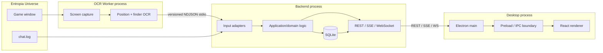
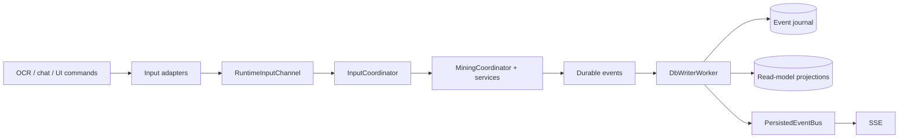
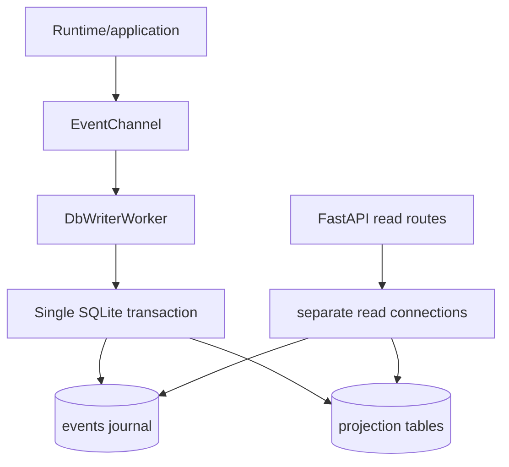
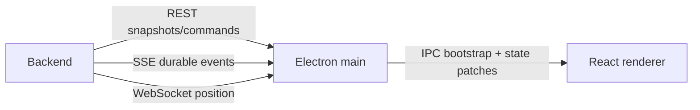
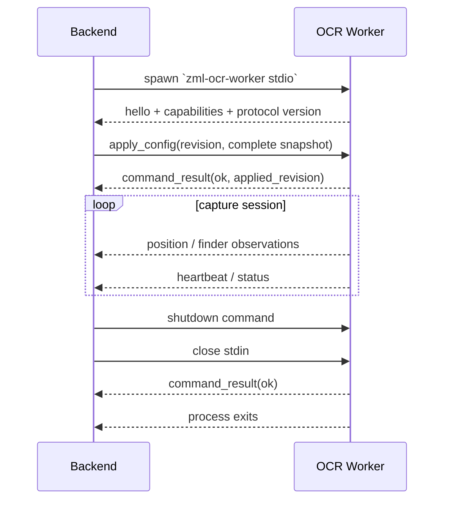
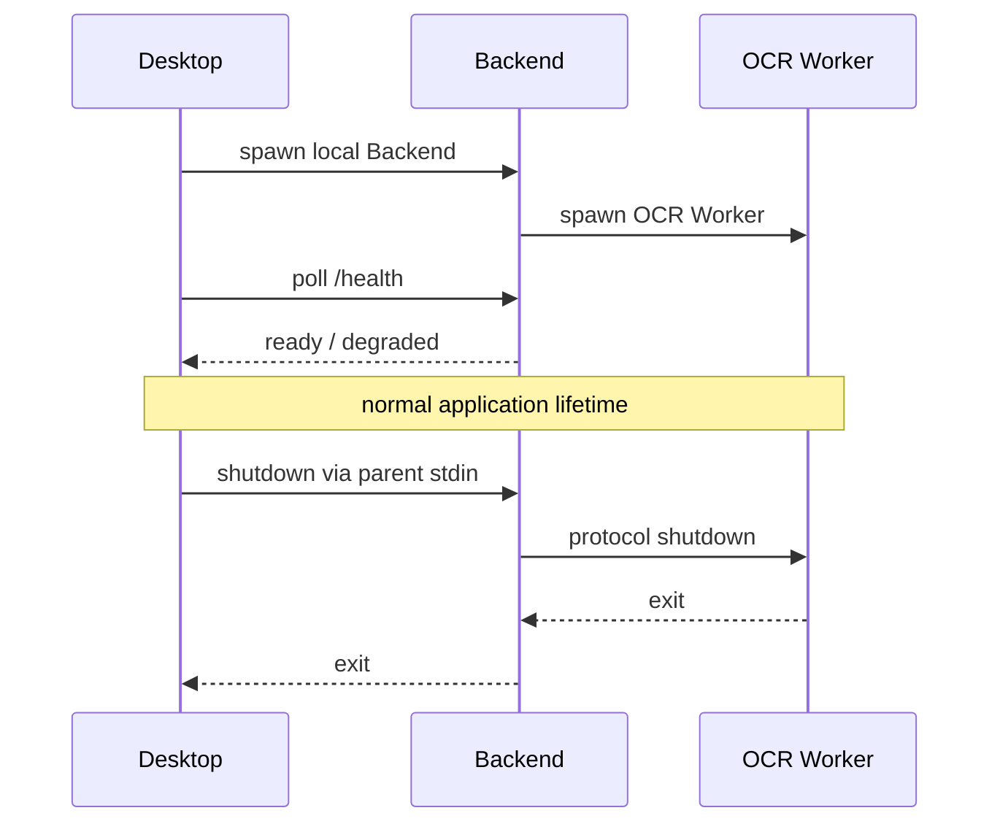
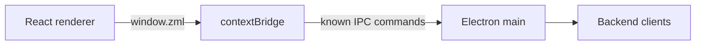
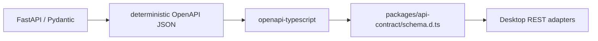

# Architecture

Updated: 2026-08-09

Z Mining Log is a local-first desktop application built around three runtime processes with explicit ownership boundaries.

## System overview



### Runtime ownership

**Desktop** owns:

- Electron windows and renderer lifecycle;
- preload/contextBridge and IPC;
- the local Backend process lifecycle;
- REST/SSE/WebSocket clients;
- desktop in-memory state and renderer distribution.

**Backend** owns:

- FastAPI and public local APIs;
- mining application/domain behavior;
- chat-log input;
- OCR Worker supervision and protocol adaptation;
- runtime queues/workers;
- SQLite persistence and read models.

**OCR Worker** owns:

- Windows screen capture;
- native OCR libraries and tessdata;
- position and finder recognition pipelines;
- OCR diagnostics, recording, and profiling;
- the stdio protocol runner.

The Backend does not import the OCR Worker implementation. The executable is a runtime dependency connected through `packages/ocr-protocol`.

## Repository ownership

```text
apps/
  desktop/
    electron/       privileged Electron main/preload code
    src/            React renderer
    shared/         types/helpers shared only inside the desktop app
  backend/
    src/zml_backend/
  ocr-worker/
    src/zml_ocr_worker/

packages/
  api-contract/     generated TS REST wire contract
  ocr-protocol/     Python OCR process wire contract
```

`packages/` is reserved for contracts that genuinely cross an application boundary. `apps/desktop/shared` belongs to the Desktop even though both Electron main and renderer consume it.

## Backend layers

The backend source is organized by responsibility:

```text
api/          FastAPI app, routes, schemas, SSE/WS channels, dependencies
application/  mining/use-case logic and application-facing models
 domain/      durable events/value objects and pure domain behavior
inputs/       external input adapters (chat, OCR protocol, mocks)
persistence/  SQLite schema, readers, event journal, projections
runtime/      queues, workers, lifecycle, supervision, bootstrap
resources/    packaged seed/reference data
```

Conceptual flow:



Important distinctions:

- **Signal**: transient observation or input. It is not persisted.
- **Command**: intent from UI/runtime that requests a state change.
- **Event**: durable domain fact eligible for persistence/projection/streaming.
- **Projection**: query-oriented state derived from durable events.

## SQLite model

SQLite uses a deliberate single-writer model.



Rules:

- API/input threads do not perform ad-hoc writes.
- Event journal and projection changes are committed together.
- API reads may use separate read connections.
- High-frequency player-position ticks are live telemetry and are not persisted as a raw event stream.

## Live transport model

Different data has different delivery semantics:

- **REST**: snapshots, queries, and commands.
- **SSE**: persisted mining/run events after successful DB writes.
- **WebSocket**: high-frequency player-position telemetry.
- **Electron IPC**: Desktop main/preload/renderer boundary.



Electron main keeps the desktop runtime snapshot and distributes typed bootstrap/state patches to renderer windows.

## OCR process boundary

Backend depends on `zml-ocr-protocol`, not `zml-ocr-worker`.

The worker process uses stdout exclusively for protocol messages and stderr for logs. Version 1 is newline-delimited JSON with strict Pydantic DTO validation.

Startup/config lifecycle:



The Backend supervisor enforces:

- hello as the first worker message;
- required worker capabilities;
- monotonic message sequence IDs;
- config acknowledgement before observations are accepted;
- heartbeat timeout detection;
- bounded restart/backoff;
- graceful shutdown followed by terminate/kill escalation when required.

A missing Entropia window is a recoverable capture state, not a process crash. The worker reports degraded health and keeps retrying capture.

## Process ownership and shutdown



Desktop may connect to an explicitly external Backend instead. In that case it does not own that Backend's lifecycle.

## Desktop security boundary

Renderer windows run with `contextIsolation: true` and `nodeIntegration: false`. The preload exposes a narrow `window.zml` API backed by known IPC channels.



Do not expose arbitrary filesystem/process primitives to the renderer when a narrow command can represent the operation.

## REST contract generation

FastAPI/Pydantic is the source of truth for HTTP request/response wire schemas.



Desktop may maintain ergonomic camelCase models and mapping functions, but it should derive REST wire shapes from the generated contract rather than copying backend schemas by hand.

SSE event payloads remain runtime-validated desktop contracts because the generic event envelope currently exposes the payload as an open object. If event-contract maintenance becomes painful, add a dedicated typed event-contract mechanism rather than folding those payloads into unrelated REST DTOs.

## Packaging boundary

Backend and OCR Worker are packaged as independent PyInstaller one-directory artifacts. The Desktop installer stages them into separate resource directories.

The packaging verification checks that:

- Backend does not contain OCR-native libraries/tessdata;
- OCR Worker contains required tessdata;
- the packaged protocol starts and shuts down correctly;
- Backend can spawn/configure the packaged OCR Worker;
- the complete process tree exits without an orphan worker.

See [packaging.md](packaging.md) for the complete build flow.

## Architecture invariants

These should not be changed incidentally:

- no OCR implementation imports in Backend;
- no second SQLite writer;
- no raw position-tick persistence;
- no renderer Node integration;
- no manual duplicate source of truth for REST wire DTOs;
- no OCR observations before config acknowledgement;
- no child process that survives its owning parent during normal shutdown.

Significant changes to these rules should be accompanied by an ADR under `docs/decisions/`.
