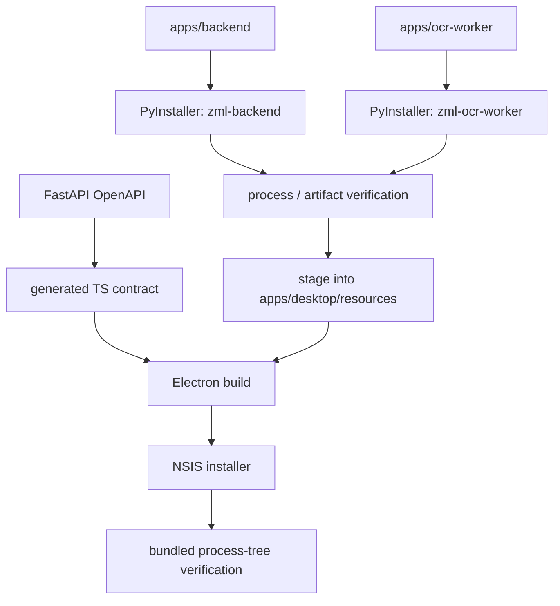

# Packaging

Updated: 2026-08-09

The supported release pipeline is Windows-first and produces one Electron/NSIS installer containing two separately packaged Python processes.

## Build overview



## Local package command

From the repository root:

```powershell
just package
```

The root recipe performs, in order:

1. Python workspace sync.
2. OCR Worker PyInstaller build.
3. Backend PyInstaller build.
4. REST API contract generation.
5. staging of both Python artifacts into Desktop resources.
6. Desktop build and `electron-builder` packaging.

## Python artifacts

Backend output:

```text
apps/backend/dist/zml-backend/
  zml-backend.exe
  _internal/...
```

OCR Worker output:

```text
apps/ocr-worker/dist/zml-ocr-worker/
  zml-ocr-worker.exe
  _internal/...
  _internal/tessdata/...
```

They are intentionally separate. Backend packaging must not absorb OCR-native dependencies.

## Artifact verification

`scripts/verify-python-artifacts.ps1` verifies the boundary instead of trusting PyInstaller configuration alone.

It checks that:

- both executables exist;
- Backend does not contain `cv2`, `mss`, numpy/OpenCV, `tesserocr`, tessdata, or Windows capture modules;
- OCR Worker contains required traineddata;
- packaged worker `--version` and `doctor` run;
- worker stdio emits protocol v1 `hello` and accepts `shutdown`;
- packaged Backend starts the packaged OCR Worker and reaches an applied config revision;
- Backend shutdown also terminates the worker process.

This smoke test is one of the main architecture guards for the process boundary.

## Desktop staging

`scripts/stage-python-components.mjs` copies already-built artifacts to:

```text
apps/desktop/resources/backend/
apps/desktop/resources/ocr-worker/
```

`electron-builder` then places them in the packaged application's resources as:

```text
resources/backend/zml-backend.exe
resources/ocr-worker/zml-ocr-worker.exe
```

At runtime Desktop supplies the worker path to Backend through `ZML_OCR_WORKER_PATH`.

## Installer

Desktop packaging uses Electron Builder with NSIS x64 output. The installer is written below:

```text
apps/desktop/release/<version>/
```

Expected installer naming:

```text
Z-Mining-Log-Windows-<version>-Setup.exe
```

Application data is not deleted on uninstall.

## GitHub Actions release flow

`.github/workflows/package-windows.yml` can be run manually and also reacts to `snapshot-*` and `v*` tags.

The workflow:

1. verifies Backend and OCR Worker;
2. packages both Python processes;
3. runs packaged process-tree verification;
4. installs the pnpm workspace with the frozen lockfile;
5. regenerates the API contract;
6. stages Python artifacts;
7. packages Desktop;
8. locates the Python executables inside `win-unpacked` and runs the same process-tree verifier again;
9. verifies the NSIS installer exists;
10. uploads the installer artifact;
11. publishes a GitHub Release for version tags.

For `v*` tags, the tag must match the Desktop `package.json` version (for example `v0.1.0`).

## Why verification runs twice

The first pass verifies the raw PyInstaller artifacts. The second pass verifies the copies that Electron Builder actually bundled. This catches staging/resource-layout mistakes that component-level packaging would miss.

## Current release limitations

- Windows is the actively verified runtime/package target.
- Code signing and public-release polish are not yet complete.
- Live gameplay smoke/soak testing is still required before treating a build as production-stable; CI validates process structure and protocol behavior, not game-window/OCR quality.
