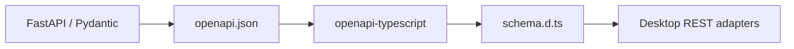

# Z Mining Log API Contract

`@zml/api-contract` is the generated TypeScript wire contract for the Backend's HTTP API.

It is deliberately small and contains no application logic.

## Source of truth



FastAPI/Pydantic is authoritative. Do **not** manually edit generated wire schemas to make TypeScript compile.

## Generate

From the repository root:

```powershell
just api generate
```

The recipe:

1. imports the FastAPI app without starting the server;
2. writes deterministic OpenAPI JSON;
3. runs `openapi-typescript`;
4. writes `schema.d.ts`.

`openapi.json` and `schema.d.ts` are ignored build artifacts. A fresh checkout must generate them before Desktop typecheck/build; root `just dev`, `just verify`, and `just build` already do that.

## Usage

Desktop imports generated schema types, commonly through `components`:

```text
components["schemas"][...]
```

Desktop-specific camelCase models and adapters can live under `apps/desktop/shared`, but the HTTP wire shape should come from this package.

## When the Backend API changes

Run:

```powershell
just api generate
just desktop verify
```

If the generated type is inconvenient, first ask whether the FastAPI schema itself should be improved. Avoid creating a parallel handwritten REST DTO that can drift from Pydantic.

## Scope

This package describes OpenAPI-visible HTTP request/response schemas. It does not currently provide a complete typed schema for arbitrary SSE event payloads; those payloads are validated separately in Desktop code.
