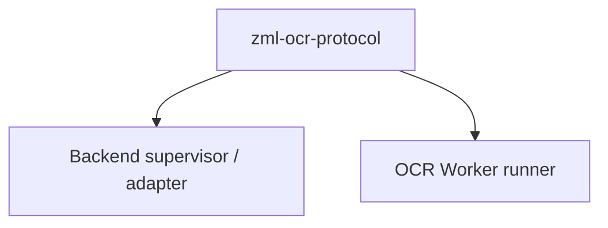
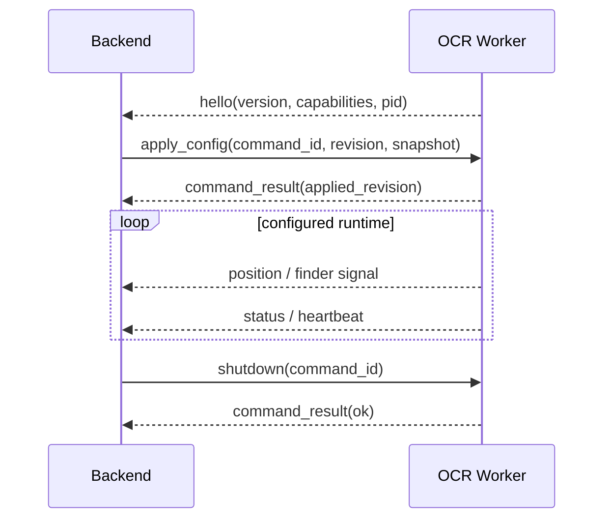

# Z Mining Log OCR Protocol

`zml-ocr-protocol` is the versioned wire contract between Backend and the standalone OCR Worker.

Version 1 uses strict Pydantic DTOs serialized as UTF-8 newline-delimited JSON over stdin/stdout.

## Ownership



The protocol package owns only the wire boundary. It must not:

- start or supervise processes;
- load Backend settings;
- capture the screen;
- run OCR;
- decide mining-domain behavior;
- depend on native OCR libraries.

Backend owns process supervision and mapping protocol observations into application inputs. OCR Worker owns capture, recognition, and application of OCR configuration.

## Transport rules

- one JSON message per stdout line;
- worker stdout is protocol-only;
- worker logs go to stderr;
- Backend commands are written to worker stdin;
- closing stdin signals parent loss/shutdown;
- protocol version is carried explicitly in messages;
- DTO validation is strict so malformed/unknown wire shapes fail at the boundary.

## Session shape



Backend additionally enforces monotonic worker sequence IDs and waits for configuration acknowledgement before accepting observations.

## Versioned vocabulary

Some DTO/type names retain the historical `Agent` / `Bridge` vocabulary (for example direction aliases such as `BridgeToAgentMessage`). These names are part of the existing protocol API. Do not rename them as part of ordinary application naming cleanup; change them only as an intentional compatibility/versioning decision.

## Commands

From the repository root:

```powershell
just protocol test
just protocol verify
```

`verify` runs Ruff lint, Ruff format check, Pyright, and Pytest.

## Compatibility changes

Treat changes to message structure, required capabilities, sequencing assumptions, or command semantics as protocol changes. If a change cannot be made backward-compatibly within the current version, introduce an explicit protocol-version strategy rather than silently changing both participants in lockstep.
